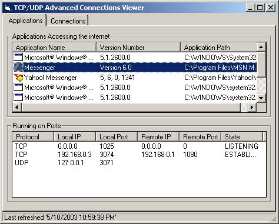



## TCP/UDP Advanced Connections Viewer

### Description

Screenshot pretty much tells all. better desciption inside. Only runs on XP and if theres extra stuff in there dont worry about it because its taken out of a bigger project im making. Please Vote and Comment
 
### More Info
 

             |
---                |---
**Submitted On**   |2003-10-05 10:21:04
**By**             |[�e7eN](https://github.com/Planet-Source-Code/PSCIndex/blob/master/ByAuthor/e7en.md)
**Level**          |Beginner
**User Rating**    |3.9 (43 globes from 11 users)
**Compatibility**  |VB 6\.0
**Category**       |[Miscellaneous](https://github.com/Planet-Source-Code/PSCIndex/blob/master/ByCategory/miscellaneous__1-1.md)
**World**          |[Visual Basic](https://github.com/Planet-Source-Code/PSCIndex/blob/master/ByWorld/visual-basic.md)
**Archive File**   |[TCP\_UDP\_Ad1654141052003\.zip](https://github.com/Planet-Source-Code/e7en-tcp-udp-advanced-connections-viewer__1-49017/archive/master.zip)

